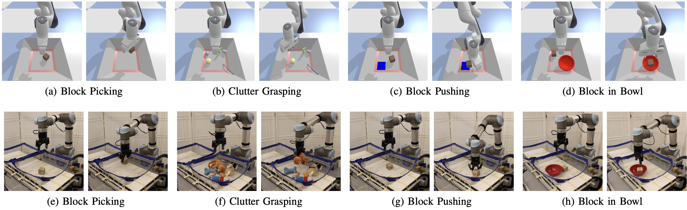

**Abstract:** Recently, equivariant neural network models have been shown to be useful in improving sample efficiency for tasks in computer vision and reinforcement learning. This paper explores this idea in the context of on-robot policy learning where a policy must be learned entirely on a physical robotic system without reference to a model, a simulator, or an offline dataset. We focus on applications of SO(2)-Equivariant SAC to robotic manipulation and explore a number of variations of the algorithm. Ultimately, we demonstrate the ability to learn several non-trivial manipulation tasks completely through on- robot experiences in less than an hour or two of wall clock time.

<style>
.column {
  float: left;
  width: 33.33%;
}
.lc{
  float: left;
  width: 16.66%;
}
.caption {
    margin: 0;
    vertical-align: baseline;
    text-align: center;
}
img.rounded {
  object-fit: cover;
  border-radius: 50%;
  height: 120px;
  width: 120px;
  margin-left: auto;
  margin-right: auto;
  display: block;
}
.people_column {
  float: left;
  width: 150px;
}
</style>

## Paper
Preprint: [arXiv](https://arxiv.org/pdf/2203.04923.pdf)  

<div style="width:100%; display:flex">
  <div class="people_column">
    
    <p class="caption">
      <a href="https://pointw.github.io">Dian Wang</a>
    </p>
  </div>
  <div class="people_column">
    
    <p class="caption">
      <a href="https://saulbatman.github.io">Mingxi Jia</a>
    </p>
  </div>
  <div class="people_column">
    
    <p class="caption">
      <a href="https://zxp-s-works.github.io">Xupeng Zhu</a>
    </p>
  </div>
  <div class="people_column">
    
    <p class="caption">
      <a href="http://mathserver.neu.edu/robin/">Robin Walters</a>
    </p>
  </div>
  <div class="people_column">
    
    <p class="caption">
      <a href="http://www.ccs.neu.edu/home/rplatt/">Robert Platt</a>
    </p>
  </div>
</div>

Khoury College of Computer Sciences  
Northeastern University

## Idea
We evaluate the on-robot learning using O(2)-Equivariant SAC in four different manipulation tasks. 

<div style="text-align:center">
  
</div>

## Video

<div style="text-align:center">
	<iframe width="853" height="480" src="https://www.youtube.com/embed/HDYoOXMojkY" frameborder="0" allow="autoplay; encrypted-media" allowfullscreen></iframe>
</div>

## Citation

```
@article{wang2022onrobot,
  title={On-Robot Policy Learning with {$\mathrm{O}(2)$}-Equivariant SAC},
  author={Dian Wang and Mingxi Jia and Xupeng Zhu and Robin Walters and Robert Platt},
  journal={arXiv preprint arXiv:2203.04923},
  year={2022}
}
```


## Contact
If you have any questions, please feel free to contact [Dian Wang](https://pointw.github.io) at wang[dot]dian[at]northeastern[dot]edu.
