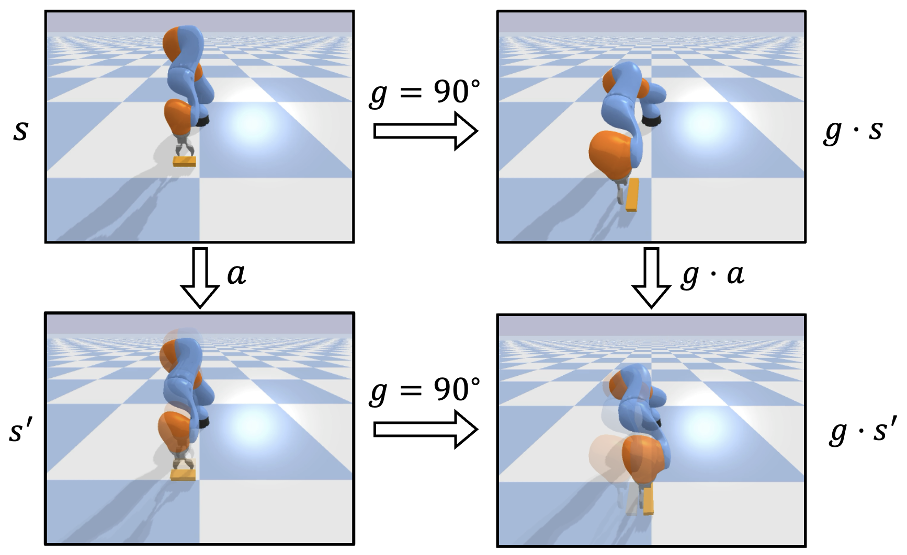
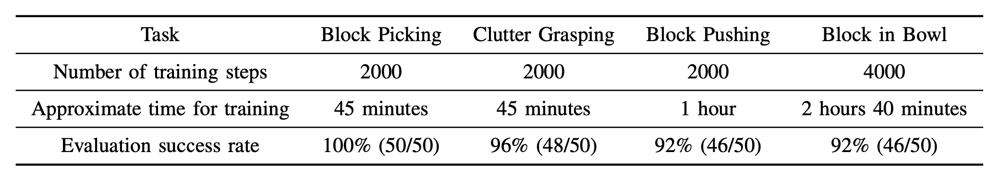
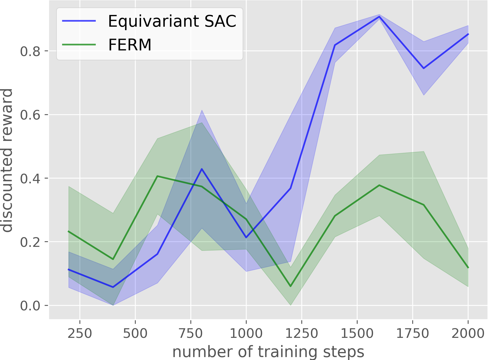

**Abstract:** Recently, equivariant neural network models have been shown to im- prove sample efficiency for tasks in computer vision and reinforcement learning. This paper explores this idea in the context of on-robot policy learning in which a policy must be learned entirely on a physical robotic system without reference to a model, a simulator, or an offline dataset. We focus on applications of Equivariant SAC to robotic manipulation and explore a number of variations of the algorithm. Ultimately, we demonstrate the ability to learn several non-trivial manipulation tasks completely through on-robot experiences in less than an hour or two of wall clock time.

<style>
.column {
  float: left;
  width: 25%;
}
.lc{
  float: left;
  width: 25%;
}
.caption {
    margin: 0;
    vertical-align: baseline;
    text-align: center;
}
img.rounded {
  object-fit: cover;
  border-radius: 50%;
  height: 120px;
  width: 120px;
  margin-left: auto;
  margin-right: auto;
  display: block;
}
.people_column {
  float: left;
  width: 150px;
}
</style>

## Paper
Published at The 6th Annual Conference on Robot Learning (CoRL 2022)  
[arXiv](https://arxiv.org/pdf/2203.04923.pdf)  

<div style="width:100%; display:flex">
  <div class="people_column">
    
    <p class="caption">
      <a href="https://pointw.github.io">Dian Wang</a>
    </p>
  </div>
  <div class="people_column">
    
    <p class="caption">
      <a href="https://saulbatman.github.io">Mingxi Jia</a>
    </p>
  </div>
  <div class="people_column">
    
    <p class="caption">
      <a href="https://zxp-s-works.github.io">Xupeng Zhu</a>
    </p>
  </div>
  <div class="people_column">
    
    <p class="caption">
      <a href="http://mathserver.neu.edu/robin/">Robin Walters</a>
    </p>
  </div>
  <div class="people_column">
    
    <p class="caption">
      <a href="http://www.ccs.neu.edu/home/rplatt/">Robert Platt</a>
    </p>
  </div>
</div>

Khoury College of Computer Sciences  
Northeastern University

## Idea
We implement sample-efficient on-robot learning using Equivariant SAC. 

<p align="center">
  
</p>

Many robotic manipulation tasks have spatial symmetries. In the block pushing example, rotating the state and the action simultaneously will not change the outcome of the pushing action.

<p align="center">
  
</p>

In Equivariant SAC, we hardcode the symmetries of the task in the structure of the actor and the critic to improve the sample efficiency. Specifically, if the input state of the actor (left) is rotated, the output action of the actor will be rotated by the same amount. If the input state and action of the critic (right) are rotated, the output Q-value of the critic will remain the same. Please see our [prior work](https://arxiv.org/pdf/2203.04439.pdf) for a detailed description of the method.

<div>
  <div class="column">
    
    <p class="caption">Block Picking</p>
  </div>
  <div class="column">
    
    <p class="caption">Block Pushing</p>
  </div>
  <div class="column">
    
    <p class="caption">Clutter Grasping</p>
  </div>
  <div class="column">
    
    <p class="caption">Block in Bowl</p>
  </div>
</div>

<p align="center" class="caption">
  The real-world experimental environments.
</p>

<p align="center">
  
</p>

Our method is sample efficient enough to learn manipulation policies directly on a real-world system. Equivariant SAC only requires less than 1 hour to solve Block Picking, Clutter Grasping, and Block Pushing. In Block in Bowl, our method requires 2 hours and 40 minitues to converge.

<div>
  <div class="lc">
    
    <p class="caption">Block Picking</p>
  </div>
  <div class="lc">
    
    <p class="caption">Block Pushing</p>
  </div>
  <div class="lc">
    
    <p class="caption">Clutter Grasping</p>
  </div>
  <div class="lc">
    
    <p class="caption">Block in Bowl</p>
  </div>
</div>

Compared with the baseline, our method has a much higher sample efficiency in on-robot learning.

## Video

<div style="text-align:center">
	<iframe width="853" height="480" src="https://www.youtube.com/embed/HDYoOXMojkY" frameborder="0" allow="autoplay; encrypted-media" allowfullscreen></iframe>
</div>

## Code
[https://github.com/pointW/equi_rl](https://github.com/pointW/equi_rl)

## Citation

```
@inproceedings{
wang2022onrobot,
title={On-Robot Learning With Equivariant Models},
author={Dian Wang and Mingxi Jia and Xupeng Zhu and Robin Walters and Robert Platt},
booktitle={6th Annual Conference on Robot Learning},
year={2022},
url={https://openreview.net/forum?id=K8W6ObPZQyh}
}
```


## Contact
If you have any questions, please feel free to contact [Dian Wang](https://pointw.github.io) at wang[dot]dian[at]northeastern[dot]edu.
